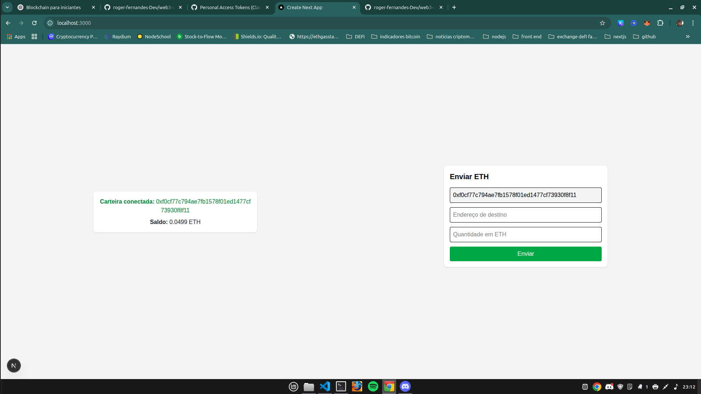

# 💸 Envio de ETH via MetaMask (Sepolia) com Next.js + ethers.js

Este projeto demonstra como conectar uma carteira MetaMask, exibir o saldo e enviar ETH em uma rede de testes da Ethereum, usando Next.js, Tailwind CSS e a biblioteca ethers.js.

---

## 🚀 Funcionalidades

✅ Conectar a carteira MetaMask  
✅ Detectar a rede conectada (Sepolia)  
✅ Exibir o endereço da carteira conectada  
✅ Exibir saldo da carteira em ETH  
✅ Enviar ETH para outro endereço digitado  
✅ Exibir status da transação (enviando / confirmada / erro)

---

## 📦 **Tecnologias usadas**

- ⚛️ **React**
- ⚡ **Next.js**
- 💅 **Tailwind CSS**
- ⛓️ **ethers.js**
- 🦊 **MetaMask**


---

## 💻 Como rodar o projeto localmente

### 1. Clone o repositório

```bash
git clone https://github.com/seu-usuario/seu-repo.git
cd seu-repo


### 1. Clone o repositório


npm install
# ou
yarn install


Abra http://localhost:3000 no navegador

## 🧪 Como testar


1 - Instale a extensão MetaMask

2 - Crie ou importe uma carteira

3 - Conecte à rede Sepolia Testnet

4 - Obtenha ETH de teste via algum faucet Sepolia

5 - Insira um endereço Ethereum válido no campo de destino

6 - nsira o valor em ETH (ex: 0.001)

7 - Clique em "Enviar" e aprove o envio na MetaMask

8 - O status será exibido na tela

## 🧠 O que eu aprendi com esse projeto

Como conectar a carteira MetaMask com ethers.js

Como obter o endereço da carteira conectada

Como buscar o saldo da carteira via getBalance()

Como montar e enviar uma transação com sendTransaction()

Como usar rede de testes (Sepolia) e faucets

Como tratar erros e feedbacks para o usuário

Como trabalhar com useState, useEffect e async/await

## ✍️ Autor
## Roger Fernandes Developer

linkedin -> https://www.linkedin.com/in/roger-fernandes-garcia-de-sousa-5a0bb214b/

github -> https://github.com/roger-fernandes-Dev


## 📄 Licença
Este projeto está sob a licença MIT.
Sinta-se livre para usar, estudar e modificar para fins educacionais.

## 🖼️ Preview


